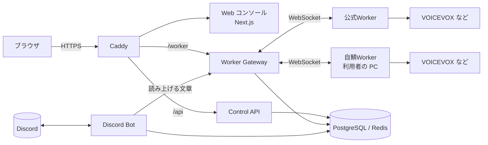

# Voiloid

Voiloid は、Discord のテキストチャンネルに書かれたメッセージを、ボイスチャンネルで読み上げる Bot です。
読み上げの設定・辞書・声は、ブラウザの管理画面（Web コンソール）からまとめて変更できます。

## できること

- **読み上げ**: `/join` で Bot をボイスチャンネルに呼び、そのテキストチャンネルの発言を読み上げます。チャンネルを固定して、自動で参加させることもできます
- **声を選べる**: VOICEVOX・AivisSpeech・COEIROINK の声から、サーバーの既定の声と、自分専用の声（マイボイス）を選べます
- **辞書**: 読み間違える単語の読み方を、サーバーごとに登録できます
- **自分の PC で音声を作る（自鯖Worker）**: 自分の PC やサーバーで音声合成を動かし、好きな声や速さで使えます
- **複数のボイスチャンネル**: サブボットを追加すると、同じサーバーの別のボイスチャンネルでも同時に読み上げられます
- **運営コンソール**: 運営者は、サーバー・ユーザー・Worker・サービス全体の設定を Web から管理できます

## ドキュメント

読む人に合わせて分けています。上から順に読めば分かるように書いています。

| 読む人 | ドキュメント | 内容 |
|---|---|---|
| サーバー管理者・メンバー | [利用者ガイド](docs/user-guide.md) | Bot の導入、読み上げの始め方、コマンド、各設定、よくある質問 |
| 自分の PC で音声を作りたい人 | [自鯖Worker ガイド](docs/self-hosted-worker.md) | 自鯖Worker の登録・起動・サーバーへの接続 |
| 運営者（はじめて） | [本番環境の構築](docs/setup.md) | Discord・ストレージ・GitHub・本番マシンの準備、`.env` の全項目、初回デプロイ |
| 運営者（日常） | [運用ガイド](docs/operations.md) | デプロイ、バックアップ、運営コンソール、公式Worker、サブボット、ログ |
| 運営者（困ったとき） | [トラブル対応](docs/troubleshooting.md) | よくあるエラーと対処 |
| 開発者 | [開発ガイド](docs/development.md) | 構成、ローカル開発、テスト、Migration、CI / CD |

## 全体の仕組み



1. Bot が Discord のメッセージを受け取り、読み上げる文章に整えて Worker Gateway に送ります
2. Worker Gateway が、そのサーバーで使える Worker を選んで音声を作らせます
3. Bot が受け取った音声をボイスチャンネルで流します

Web コンソールは Control API を通して設定を読み書きします。Worker は音声合成ソフトのそばで動き、Worker Gateway に WebSocket で接続します。

## リポジトリの構成

```
apps/
  web/       Web コンソール（Next.js）
  api/       Control API（Fastify）: ログイン・権限・設定・運営コンソール
  gateway/   Worker Gateway: Worker の接続と、音声合成の振り分け
  bot/       Discord Bot（discord.js）
  worker/    音声合成 Worker（VOICEVOX などのそばで動く）
packages/
  shared/    共通の型・振り分けのルール・読み上げる文章の整え方
  database/  データベース（Prisma / PostgreSQL）
docs/        ドキュメント
```

開発の始め方は [開発ガイド](docs/development.md) を参照してください。
