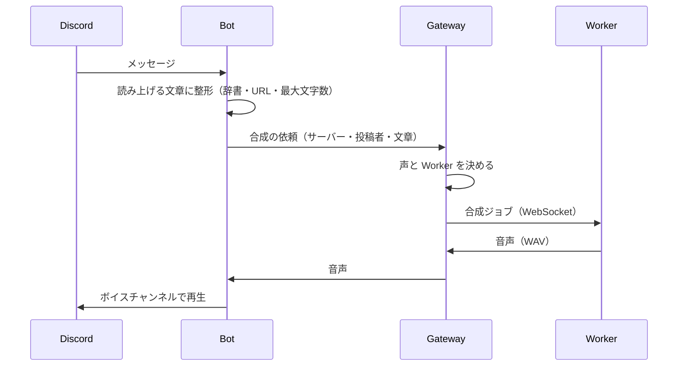

# 開発ガイド

Voiloid の開発に参加する人向けの説明です。

- [1. 構成](#1-構成)
- [2. 仕組み](#2-仕組み)
- [3. ローカルで動かす](#3-ローカルで動かす)
- [4. テスト](#4-テスト)
- [5. データベースと Migration](#5-データベースと-migration)
- [6. CI / CD](#6-ci--cd)
- [7. コードの決まり](#7-コードの決まり)

---

## 1. 構成

npm workspaces の monorepo です。言語はすべて TypeScript です。

| パス | 役割 | 主な技術 |
|---|---|---|
| `apps/web` | Web コンソール（利用者の設定画面・運営コンソール） | Next.js 16、shadcn/ui、Playwright |
| `apps/api` | Control API。ログイン・権限の確認・設定・運営コンソール | Fastify 5、Zod |
| `apps/gateway` | Worker Gateway。Worker の WebSocket 接続と、音声合成の振り分け | ws |
| `apps/bot` | Discord Bot。メッセージの読み上げとコマンド | discord.js、@discordjs/voice |
| `apps/worker` | 音声合成 Worker。VOICEVOX などのそばで動く | — |
| `packages/shared` | 共通の型（API の契約）・振り分けのルール・読み上げる文章の整形・サービス間の通信の形式 | Zod |
| `packages/database` | DB の定義・Migration・データの読み書き | Prisma 7、PostgreSQL |

DB に接続するのは api・gateway・bot だけです。Web コンソールは api を、Worker は gateway を通します。

---

## 2. 仕組み

### 読み上げの流れ



### 声と Worker の決まり方

`packages/shared/src/voice/routing.ts` の純粋関数で決めます。api（画面に出す「使えるエンジン」）と gateway（実際の振り分け）が同じ関数を使うので、表示と動作が食い違いません。

1. 投稿者が使える Worker を集める: 投稿者が「自分専用」で接続した Worker → サーバーで使える Worker（サーバーの Worker モードに従う）
   - 公式Worker は、担当するサーバーが指定されていれば、そのサーバーだけで使う
2. 声を決める: 投稿者のマイボイス（そのエンジンを持つ Worker があり、サーバーでオフにされていない場合）→ サーバーのデフォルト音声
3. 同じグループの中では、失敗の少ない・空いている Worker から試し、失敗したら次へ

### 設定の変更の伝わり方

Web で設定を変えると、api が Redis の Pub/Sub（`voiloid:invalidate`）に通知し、bot と gateway がキャッシュを捨てて読み直します。

| 通知 | 送るとき | 受け取った側 |
|---|---|---|
| `guild` | サーバーの設定・辞書 | bot・gateway がそのサーバーを読み直す |
| `user` | マイボイス・利用停止 | 読み直す |
| `worker` | Worker の削除・トークン再発行・メンテナンス・エンジンのオンオフ | gateway が振り分けを計算し直し、接続中なら切断して再認証させる |
| `routing` | 公式Worker の担当サーバー | gateway が振り分けを計算し直す（切断しない） |
| `system` | サービス設定 | bot が読み直す（一時停止なら読み上げを終了） |

運営コンソールからの Bot への指示（読み上げの強制終了・退出・コマンドの再登録・プロフィールの反映）は、`voiloid:bot-commands` に送り、Bot が結果を Redis に書きます。

### 安全のための決まり

- Discord の権限（サーバーを管理できるか）は、毎回 api が Discord の情報で確認します。Web の表示だけで判断しません
- Discord のトークンはブラウザに渡しません（api が暗号化して Redis に保存）
- Worker のトークンは DB にハッシュだけを保存し、表示は発行したときの 1 回だけです
- メッセージの本文は保存しません

---

## 3. ローカルで動かす

### 必要なもの

- Node.js 24（`.nvmrc`）
- Docker（開発用の PostgreSQL と Redis に使います）

### 準備

```bash
npm ci
npm run dev:deps                                         # PostgreSQL・Redis を起動（compose.dev.yaml）
cp packages/database/.env.example packages/database/.env
npm run db:generate                                      # Prisma のコードを生成
npm run db:migrate                                       # 開発用の DB に Migration を適用
npm run db:seed                                          # 開発用のデータ（Worker のトークンが表示される）
```

### Web コンソールだけを動かす（モック）

Backend なしで、画面だけを確認できます。データはメモリ上のモック（`apps/web/lib/mock`）です。

```bash
npm run dev -w @voiloid/web     # http://localhost:3000
```

`NEXT_PUBLIC_USE_MOCK=false` にすると、本物の api（`NEXT_PUBLIC_API_BASE_URL`）に接続します。

### すべてのサービスを動かす

各アプリのフォルダに `.env` を作り、`npm run dev -w @voiloid/<アプリ>` で起動します。必要な環境変数は、各アプリの `src/config.ts` に説明付きで書いてあります。

| アプリ | 主な環境変数 |
|---|---|
| api | `APP_ORIGIN`・`DATABASE_URL`・`REDIS_URL`・`DISCORD_CLIENT_ID`・`DISCORD_CLIENT_SECRET`・`DISCORD_BOT_TOKEN`・`GATEWAY_INTERNAL_URL`・`INTERNAL_API_TOKEN`・`SESSION_ENCRYPTION_KEY`・`IP_HASH_SALT`・`S3_*`・`COOKIE_SECURE=false`（http で動かす場合） |
| gateway | `DATABASE_URL`・`REDIS_URL`・`INTERNAL_API_TOKEN` |
| bot | `DISCORD_TOKEN`・`DISCORD_CLIENT_ID`・`APP_ORIGIN`・`DATABASE_URL`・`REDIS_URL`・`GATEWAY_INTERNAL_URL`・`INTERNAL_API_TOKEN`・`DEV_GUILD_ID`（コマンドをそのサーバーにだけすぐ登録する） |
| worker | `CONTROL_SERVER`（例: `ws://127.0.0.1:4100/worker`）・`WORKER_TOKEN`（seed で表示された値）・`WORKER_ENGINES`・`ALLOW_INSECURE=true` |

開発用の Discord アプリと Bot は、本番とは別に作ってください。スラッシュコマンドは `npm run deploy-commands -w @voiloid/bot` で登録します。

---

## 4. テスト

| コマンド | 内容 |
|---|---|
| `npm test` | 単体テスト |
| `npm run test:integration` | 統合テスト（実際の PostgreSQL・Redis を使う。テスト専用の DB `voiloid_test` と Redis の DB 15） |
| `npm run test:coverage` | 単体 + 統合 + カバレッジの基準（全体 90%、分岐 85%、`packages/shared` は 100%） |
| `npm run test:e2e -w @voiloid/web` | Web コンソールの E2E（Playwright。先に `NEXT_PUBLIC_USE_MOCK=true npm run build -w @voiloid/web`） |
| `npm run check` | 書式・Lint・型・テストをまとめて実行（CI と同じ。**プルリクエストの前に必ず通す**） |

- 統合テストは、DB 名が `_test` で終わる場合だけ動きます（開発・本番の DB を誤って消さないため）
- 実際の VOICEVOX を使った確認: `VOICEVOX_E2E_URL=http://127.0.0.1:50021 npx vitest run --project integration apps/worker`
- テストの名前は日本語で、何を確かめるかが分かるように書きます

---

## 5. データベースと Migration

### 変更のしかた

1. `packages/database/prisma/schema.prisma` を変更する
2. `npm run db:migrate` で Migration を作る（`packages/database/prisma/migrations/<日時>_<名前>/migration.sql`）
3. `schema.prisma` と `migration.sql` の両方をプルリクエストでレビューする

### 方針

- **前のバージョンのアプリでも動く変更だけにする**（デプロイは「Migration → 新しいアプリの起動」の順で、失敗するとアプリだけ前のバージョンに戻るため）
- 本番では `prisma migrate deploy` だけを使います。`prisma migrate dev`・`prisma db push`・`prisma migrate reset` は本番で使いません
- 列やテーブルを消す・型を変えるなどの壊れる変更は、段階的に行います: 新しい列を追加（NULL 可）→ アプリを更新 → データを移す → 制約を付ける → 古い列を消す
- CI（`scripts/check-migrations.mjs`）が、列・テーブルの削除、型の変更、既定値の無い NOT NULL の追加などを見つけると失敗します。意図した変更なら、`migration.sql` に `-- migration-review: <理由>` と書いてレビューで確認します
- CHECK 制約など Prisma で書けない制約は、`migration.sql` に手で追記します（最初の Migration を参照）

---

## 6. CI / CD

| ワークフロー | いつ動くか | 内容 |
|---|---|---|
| CI（`ci.yml`） | プルリクエスト・main への push | 書式・Lint・型・本番の依存の脆弱性（`npm audit`）→ 単体・統合テスト（カバレッジ）→ Migration の検査（空の DB に全 Migration、Schema との差分、壊れる変更の確認）→ E2E → 全イメージの Docker ビルド |
| Deploy（`deploy.yml`） | main の CI が成功したとき・手動 | 本番マシンの runner が `scripts/deploy.sh` を実行（[運用ガイド 2](operations.md#2-デプロイ)） |
| Worker image（`worker-image.yml`） | `v` で始まるタグ・手動 | 自鯖Worker のイメージを GHCR に公開 |
| CodeQL | main への push・毎週 | コードの脆弱性の検査（公開リポジトリのときだけ） |
| Dependabot | 毎週 | 依存の更新のプルリクエスト |

---

## 7. コードの決まり

- **型**: `any` を使いません。外から来るデータ（API の入力・環境変数・Redis・WebSocket）は Zod で検証します
- **API の契約**: `packages/shared/src/contracts` が正です。Web の型（`apps/web/types`）との一致は `apps/web/types/contract-check.ts` がコンパイル時に確かめます
- **モック**: Web のモックは `apps/web/lib/mock` だけに置き、本番では使いません
- **秘密の値**: Worker のトークンなどを `localStorage` に保存しません。Discord の secret をブラウザに出しません
- **文言**: 画面の文言は `apps/web/lib/i18n/dictionaries` の日本語・英語の両方に追加します
- **運営者の操作**: 壊す操作・利用停止には理由を必須にし、監査ログに `admin.*` として残します
- **書式**: Prettier と ESLint（`npm run format`・`npm run lint`）。コメントは日本語で、「なぜそうするか」を書きます
- **コミット**: `npm run check` が通ってから。main へは直接 push せず、プルリクエストを通します
