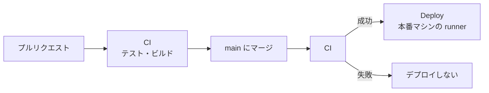

# 運用ガイド

本番環境を動かし続けるための手順です。最初の構築は [本番環境の構築](setup.md)、エラーが出たときは [トラブル対応](troubleshooting.md) を参照してください。

- [1. 変更が本番に届くまで](#1-変更が本番に届くまで)
- [2. デプロイ](#2-デプロイ)
- [3. ロールバック](#3-ロールバック)
- [4. 運営コンソール](#4-運営コンソール)
- [5. 公式Workerの追加](#5-公式workerの追加)
- [6. サブボットの追加](#6-サブボットの追加)
- [7. バックアップと復元](#7-バックアップと復元)
- [8. ログ・状態の確認](#8-ログ状態の確認)
- [9. 設定（.env）を変えるとき](#9-設定envを変えるとき)
- [10. セキュリティ](#10-セキュリティ)
- [11. 本番公開前の確認](#11-本番公開前の確認)

本書のコマンドは、特に書いていなければ本番マシンで `actions` ユーザーになり、リポジトリのフォルダで実行します。

```bash
sudo -iu actions
cd /srv/voiloid/actions-runner/_work/voiloid/voiloid
```

---

## 1. 変更が本番に届くまで



- **CI**（`.github/workflows/ci.yml`）: 書式・Lint・型・依存の脆弱性 → テスト（カバレッジ）→ Migration の検査 → E2E → 全イメージのビルド
- **Deploy**（`.github/workflows/deploy.yml`）: main の CI が成功すると、本番マシンの runner が `scripts/deploy.sh` を実行します
- runner が止まっていると、Deploy は「待機中」のまま止まります（24 時間で失敗になります）。`/srv/voiloid/actions-runner` で `sudo ./svc.sh status` を実行して確認してください

---

## 2. デプロイ

### 自動で行われること（`scripts/deploy.sh`）

1. このコミットのイメージを本番マシンでビルドする（タグ = コミット ID の先頭 12 文字）
2. **DB をバックアップ** する（`BACKUP_DIR/pre-deploy-<タグ>-<日時>.dump`）
3. **Migration を適用** する（まだ適用していない分だけ。データは消えません）
4. 新しいイメージで起動し、全サービスのヘルスチェックが通るまで待つ
5. 外から Control API に届くか確認する
6. 4・5 が失敗したら、**直前のバージョンに自動で戻す**

DB のデータは Docker のボリューム（`voiloid_postgres-data`）にあり、デプロイで消えることはありません。

### 手動でデプロイする

- **GitHub から（おすすめ）**: 「Actions」→「Deploy」→「Run workflow」。特定のコミットを指定することもできます
- **本番マシンから**:
  ```bash
  git fetch && git checkout <コミット>
  DEPLOY_ENV_FILE=/srv/voiloid/.env DEPLOY_STATE_DIR=/srv/voiloid/state ./scripts/deploy.sh
  ```

---

## 3. ロールバック

### アプリを前のバージョンに戻す

デプロイに失敗した場合は自動で戻ります。手動で戻す場合:

```bash
IMAGE_TAG=$(cat /srv/voiloid/state/previous-tag) docker compose --env-file /srv/voiloid/.env up -d --wait
```

### DB は戻さない（Forward-fix）

Migration は元に戻しません。問題があれば、それを直す新しい変更をデプロイします（Forward-fix）。
そのため Migration は、**前のバージョンのアプリでも動く変更だけ** にしています（[開発ガイド](development.md#5-データベースと-migration)）。
どうしても DB を戻す必要があるときは、デプロイ前のバックアップから復元します（[7](#7-バックアップと復元)）。

---

## 4. 運営コンソール

Web コンソールのサイドバーの「運営」から使います。

### 4-1. 運営者と権限

`.env` の `OPERATOR_DISCORD_USER_IDS` に書いた人は **オーナー** です。オーナーは「運営者」画面から、他の人を権限付きで追加できます（再デプロイは不要）。

| 権限 | 決め方 | できること |
|---|---|---|
| 閲覧者（viewer） | Web | すべての画面を見るだけ |
| 編集者（editor） | Web | 閲覧 + サーバー・ユーザー・Worker の操作 |
| 管理者（admin） | Web | 編集 + Bot の退出・ユーザーデータの削除・サービス設定・コマンドの再登録・運営者の管理 |
| オーナー（owner） | `.env` | すべて（Web から変更・削除できない） |

- 権限は Control API が毎回確認します。運営者でない人には、運営コンソールの API は存在しないように見えます（404）
- 自分自身とオーナーは、利用停止・削除・権限の変更ができません

### 4-2. 画面とできること

| 画面 | 見られること | 操作（必要な権限） |
|---|---|---|
| 概要 | Bot の状態、Worker の接続数、サーバー数・ユーザー数、利用量、最近の操作 | — |
| Worker | 公式Worker・自鯖Worker の一覧（状態での絞り込み）、詳細（情報・エンジン・性能・担当するサーバー） | editor: 公式Worker の追加、名前変更、メンテナンス、切断、トークン再発行、削除、エンジンのオンオフ、公式Worker の担当するサーバー、自鯖Worker の接続先を外す |
| サーバー | 検索、詳細（設定・接続された Worker・読み上げ中のチャンネル・利用量・操作の記録） | editor: サーバー管理者と同じ設定画面での編集、読み上げの強制終了、利用停止・解除（理由が必須）、自鯖Worker の接続を外す。admin: Bot を退出させる（理由が必須） |
| ユーザー | 検索、詳細（権限・マイボイス・ログイン中のセッション数・自鯖Worker） | editor: マイボイスのリセット、強制ログアウト、利用停止・解除（理由が必須）。admin: データの削除（理由が必須） |
| 監査ログ | すべての操作の記録（種類・サーバーで絞り込み） | — |
| サービス設定 | 現在の設定 | admin: 上限（自鯖Worker の数・辞書の単語数・最大文字数）、新しいサーバーの初期値、お知らせ、全サーバーの読み上げの一時停止、スラッシュコマンドの再登録 |
| 運営者 | 運営者と権限 | admin: 追加・権限の変更・削除 |

### 4-3. 操作の影響

| 操作 | 影響 |
|---|---|
| サーバーの利用停止 | 読み上げを終了し、Bot はそのサーバーで読み上げ・`/join`・`/dict` を受け付けません。サーバー管理者の画面には「利用停止中」と表示され、設定を変更できません |
| ユーザーの利用停止 | ログアウトさせ、再ログインもできなくなります。Bot はその人の発言を読まず、コマンドも受け付けません |
| ユーザーデータの削除 | マイボイス・自鯖Worker（トークンも無効）・ログイン情報を削除します。辞書と監査ログは残り、作成者・実行者は匿名になります |
| 読み上げの一時停止 | すべての読み上げを終了し、解除するまで `/join` と自動参加を受け付けません（メンテナンス用） |
| お知らせ | 全ユーザーの画面の上部に表示されます（情報 / 警告） |
| Bot への指示（強制終了・退出・コマンドの再登録） | Redis を通して Bot に送り、最大 10 秒結果を待ちます。Bot が止まっていると失敗します |

### 4-4. 記録

- 運営者の操作は、すべて監査ログに `admin.*` として残ります。利用停止などの理由も記録されます
- 運営コンソールからサーバーの設定などを変えた場合は、通常の操作名に `asOperator: true` が付きます

### 4-5. Web からはできないこと

`.env` の秘密の値の変更、DB の復元・Migration・デプロイ、監査ログの編集・削除、メッセージ本文の閲覧（保存していません）。これらは本番マシンで行います。

---

## 5. 公式Workerの追加

公式Worker は、運営が用意する音声合成のマシンです。登録・トークン再発行・削除は、運営コンソールからだけ行えます（editor 以上）。

### 5-1. 登録する

1. 「運営」→「Worker」→「公式Worker」タブ →「公式Workerを追加」
2. 名前（例: `official-tokyo-01`）と、そのマシンで動かすエンジンを選ぶ
3. 表示された **接続トークン** と `.env` の例を控える（表示されるのはこのときだけ。DB にはハッシュだけを保存します）

トークンは `wkr_<公開ID>.<秘密の値>` という形です。持っている人なら誰でもこの公式Worker として接続できるので、画像や文章に貼らず、動かすマシンにだけ置いてください。

### 5-2. 起動する

**A. 本番マシンで一緒に動かす（VOICEVOX のみ・いちばん手軽）**

1. 登録するときに、エンジンを VOICEVOX だけにする
2. `/srv/voiloid/.env` の `OFFICIAL_WORKER_TOKEN` にトークンを書く
3. 再デプロイする（「Actions」→「Deploy」→「Run workflow」）。`official-worker` と `voicevox` も起動します

本番マシンの CPU とメモリを使うので、読み上げが多い場合は B にしてください。

**B. 別のマシンで動かす（AivisSpeech なども可）**

Worker のマシンで、このリポジトリからイメージを作ります（GHCR のイメージを公開していなくても使えます）。

```bash
git clone https://github.com/rebuilerdev/voiloid.git
cd voiloid
docker build --target worker -t voiloid/worker:local .
```

作業用のフォルダ（例: `~/voiloid-worker`）に、2 つのファイルを置きます。

`.env`（登録時に表示された 3 行。`chmod 600 .env` にする）:

```
CONTROL_SERVER=wss://<あなたのドメイン>/worker
WORKER_TOKEN=<トークン>
WORKER_ENGINES=VOICEVOX,AivisSpeech
```

`compose.yaml`:

```yaml
services:
  worker:
    image: voiloid/worker:local
    restart: unless-stopped
    env_file: .env
    environment:
      VOICEVOX_URL: http://voicevox:50021
      AIVISSPEECH_URL: http://aivisspeech:10101
    depends_on: [voicevox, aivisspeech]

  voicevox:
    image: voicevox/voicevox_engine:cpu-latest
    restart: unless-stopped

  aivisspeech:
    image: ghcr.io/aivis-project/aivisspeech-engine:cpu-latest
    restart: unless-stopped
```

```bash
docker compose up -d
docker compose logs -f worker      # "connected to the gateway" と出れば接続成功
```

- `WORKER_ENGINES` には、そのマシンで **実際に動いている** エンジンだけを書きます（COEIROINK には公式の Docker イメージがありません）
- GPU があるマシンなら、`voicevox/voicevox_engine:nvidia-latest` を使うと速くなります（NVIDIA Container Toolkit が必要）
- 本番を更新したら、Worker も `git pull` → `docker build` → `docker compose up -d` で揃えます

### 5-3. 詳細ページでできること

「Worker」の一覧で名前を押すと開きます。

| 項目 | 説明 |
|---|---|
| エンジンのオンオフ | 止めたエンジンは、Worker が動かしていても読み上げ・声の一覧・プレビューに使いません。切り替えると Worker が数秒だけ再接続します。調子の悪いエンジンを一時的に外すときに使います |
| 担当するサーバー | 既定は「全サーバー」。「指定したサーバーだけ」にすると、追加したサーバーでだけ使います（専用の Worker や試験運用に）。Worker は切断しません |
| メンテナンス | 振り分けから外し、接続も受け付けなくなります（削除はしません） |
| トークンを再発行 | 古いトークンはすぐに使えなくなり、接続も切れます。新しいトークンで起動し直してください |

---

## 6. サブボットの追加

サブボットは、同じサーバーの別のボイスチャンネルで同時に読み上げるための追加の Bot です。音声を流すだけで、コマンドとメッセージはメインの Bot が扱います。

1. Discord Developer Portal でサブボットごとにアプリを作り、Bot のトークンを発行する（Message Content Intent は不要）。名前とアイコンもここで設定する
2. `/srv/voiloid/.env` の `SUB_BOT_TOKENS` に、トークンをカンマ区切りで書く（並び順が画面での表示順になります）
3. 再デプロイする（「Actions」→「Deploy」→「Run workflow」）
4. 各サーバーの管理者が、サーバーの「Overview」→「Bot」で、未参加のサブボットを「招待」する

- Bot は起動時に、各 Bot が参加しているサーバーを記録し、その後の参加・退出も記録します。サーバー一覧のカードに「サブボット 1 / 2 参加中」のように表示されます
- サブボットの招待で求める権限は「チャンネルを見る・接続・発言」だけです
- サーバーごとの Bot のプロフィール（名前・アイコン）は、サブボットにも反映されます。この機能より前に保存したプロフィールは、もう一度保存すると反映されます
- `SUB_BOT_TOKENS` から外したサブボットは、画面に表示されなくなります

---

## 7. バックアップと復元

### 自動のバックアップ

- `backup` サービスが、`BACKUP_INTERVAL_SECONDS`（既定 1 日）ごとに DB をバックアップし、`BACKUP_RETENTION_DAYS`（既定 14 日）を過ぎたものを消します
- デプロイの前にも、毎回バックアップします
- バックアップは同じマシンにあります。**マシンが壊れると一緒に失われるので、別の場所（オブジェクトストレージなど）にも定期的にコピーしてください**

```bash
ls -lh /srv/voiloid/backups     # バックアップの一覧
```

### 復元

```bash
DEPLOY_ENV_FILE=/srv/voiloid/.env DEPLOY_STATE_DIR=/srv/voiloid/state \
  ./scripts/restore.sh /srv/voiloid/backups/<ファイル名>.dump
```

1. 確認のため `restore` と入力すると始まります
2. Web・API・Gateway・Bot を止め、DB をバックアップの内容に置き換え、今のバージョンで起動し直します

**復元すると、今の DB はバックアップの時点の内容に置き換わります。** 実行する前に、今の DB もバックアップしておいてください。

少なくとも月に 1 回、別の環境で復元を試し、アプリが起動することを確認してください。

---

## 8. ログ・状態の確認

```bash
docker compose --env-file /srv/voiloid/.env ps                                   # 各サービスの状態
docker compose --env-file /srv/voiloid/.env logs -f --tail 100 api gateway bot   # ログを見る
cat /srv/voiloid/state/deployed-tag                                              # 今動いているバージョン
```

- ログは JSON 形式です。Cookie・トークン・画像データは出力しません
- エラー画面に出る `requestId` は、api のログの `reqId` と同じ値です。問い合わせを受けたら、これでログを探します
- Web コンソールの Dashboard と運営コンソールの概要でも、Bot と Worker の状態を確認できます

### 1 つのサービスだけ再起動する

```bash
IMAGE_TAG=$(cat /srv/voiloid/state/deployed-tag) docker compose --env-file /srv/voiloid/.env up -d bot
```

**`IMAGE_TAG` を必ず付けてください。** 付けないと、存在しない `latest` のイメージで起動しようとして失敗します。

---

## 9. 設定（.env）を変えるとき

1. `/srv/voiloid/.env` を編集する
2. 再デプロイする（「Actions」→「Deploy」→「Run workflow」）

`DISCORD_CLIENT_ID`・`APP_DOMAIN`・`WORKER_IMAGE` は Web コンソールのビルドに埋め込まれるため、変えたら必ず再デプロイします。

---

## 10. セキュリティ

- **本番マシンに入れる人を絞る**: Docker を使える人は、DB を直接書き換えたり `.env` を読んだりできます。ログインできる人と docker グループのユーザーは、運営の管理者だけにします
  ```bash
  getent group docker      # docker グループのユーザー
  getent group sudo        # sudo を使えるユーザー
  ```
- **SSH は鍵認証だけ** にし、パスワードでのログインを無効にします
- **秘密の値が漏れたら、すぐに作り直します**

  | 漏れたもの | 対処 |
  |---|---|
  | `DISCORD_TOKEN`・`SUB_BOT_TOKENS` | Developer Portal の「Bot」→「Reset Token」→ `.env` を更新 → 再デプロイ |
  | `DISCORD_CLIENT_SECRET` | 「OAuth2」→「Reset Secret」→ `.env` を更新 → 再デプロイ |
  | Worker のトークン | 運営コンソールの Worker の「トークンを再発行」 |
  | `SESSION_ENCRYPTION_KEY` | 作り直して再デプロイ（全員が再ログインになります） |

- **公開リポジトリと runner**: 外部のプルリクエストのワークフローは、承認してから実行する設定にしておきます（[構築 6-3](setup.md#6-3-安全のための設定)）

---

## 11. 本番公開前の確認

| 項目 | 確認のしかた |
|---|---|
| DB の変更のレビュー | プルリクエストで `schema.prisma` と `migration.sql` を確認（CI が危険な変更を検出） |
| Migration のテスト | CI（空の DB に全 Migration を適用 → Schema と差分が無いこと） |
| ロールバックの手順 | 本書 3 |
| DB の制約（Unique・Foreign Key・Cascade・CHECK） | 統合テスト（`packages/database/src/constraints.int.test.ts`） |
| まとめて行う処理（Transaction） | 統合テスト（Worker の登録・削除・トークン再発行・接続先・Bot のプロフィール） |
| 余分な問い合わせ（N+1） | 振り分けの候補・使えるエンジン・接続先は 1 回の問い合わせで取得 |
| DB の接続数 | 各アプリの `DATABASE_POOL_SIZE` |
| バックアップと復元 | 本書 7（復元のテストを定期的に行う） |
