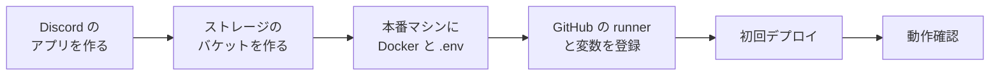

# 本番環境の構築

Voiloid を本番で動かすための、**最初の 1 回だけ** 行う準備です。上から順に進めてください。
日常の運用（デプロイ・バックアップなど）は [運用ガイド](operations.md)、エラーが出たときは [トラブル対応](troubleshooting.md) を参照してください。

- [0. 全体の流れ](#0-全体の流れ)
- [1. 用意するもの](#1-用意するもの)
- [2. Discord の準備](#2-discord-の準備)
- [3. 画像の保存先（S3 互換ストレージ）の準備](#3-画像の保存先s3-互換ストレージの準備)
- [4. 本番マシンの準備](#4-本番マシンの準備)
- [5. 環境変数ファイル（.env）を作る](#5-環境変数ファイルenvを作る)
- [6. GitHub の準備](#6-github-の準備)
- [7. 初回のデプロイ](#7-初回のデプロイ)
- [8. 動作の確認](#8-動作の確認)

---

## 0. 全体の流れ



本番マシンでは、GitHub Actions の **self-hosted runner**（GitHub からの指示で処理を実行するプログラム）が動きます。
main ブランチに変更が入り CI が成功すると、runner が本番マシンでビルド・バックアップ・Migration・起動を自動で行います。

---

## 1. 用意するもの

| もの | 説明 |
|---|---|
| Linux のサーバー | Ubuntu など。目安は 2 CPU・4 GB メモリ以上（同じマシンで公式Worker の VOICEVOX・AivisSpeech も動かすなら 4 CPU・8〜12 GB 以上） |
| ドメイン | Web コンソールの URL（例: `voiloid.example.com`）。DNS の A レコードを本番マシンの IP アドレスに向けます |
| 開いたポート | 80 と 443（HTTPS の証明書を自動で取得するため。両方を外部から接続できるようにします） |
| Discord のアカウント | Developer Portal でアプリを作ります |
| S3 互換のストレージ | Bot のアイコン画像の保存先（Cloudflare R2・AWS S3 など） |
| GitHub のリポジトリ | このリポジトリ（CI / CD に使います） |

---

## 2. Discord の準備

[Discord Developer Portal](https://discord.com/developers/applications) で行います。

### 2-1. アプリを作る

1. 「New Application」を押し、名前（例: `Voiloid`）を付けて作る
2. 「General Information」の **Application ID** を控える → `.env` の `DISCORD_CLIENT_ID`
3. 「General Information」でアイコンを設定する（Bot の既定のアイコンになります）

### 2-2. ログイン（OAuth2）の設定

1. 「OAuth2」→ **Client Secret** の「Reset Secret」を押し、表示された値を控える → `.env` の `DISCORD_CLIENT_SECRET`
   - 表示されるのは 1 回だけです。漏れたら、もう一度「Reset Secret」で作り直します
2. 「OAuth2」→「Redirects」に次を追加して保存する
   ```
   https://<あなたのドメイン>/api/auth/callback
   ```

### 2-3. Bot の設定

1. 「Bot」→「Reset Token」を押し、表示された値を控える → `.env` の `DISCORD_TOKEN`
   - **このトークンが漏れると Bot を乗っ取られます。** 誰にも見せないでください
2. 「Bot」→「Privileged Gateway Intents」の **Message Content Intent** をオンにして保存する（メッセージを読み上げるために必要）

### 2-4. サブボット（必要な場合だけ）

同じサーバーの別のボイスチャンネルでも同時に読み上げたい場合は、サブボットを作ります。後から追加することもできます（[運用ガイド](operations.md#6-サブボットの追加)）。

1. サブボットごとに「New Application」でアプリを作る（例: `Voiloid 2`）。名前とアイコンもここで設定します
2. 「Bot」→「Reset Token」でトークンを控える → `.env` の `SUB_BOT_TOKENS`（カンマ区切り）
3. Message Content Intent は **不要** です

| 値 | 公開してよいか | 用途 |
|---|---|---|
| `DISCORD_CLIENT_ID` | 公開してよい | アプリの ID。招待・ログインの URL に含まれます |
| `DISCORD_CLIENT_SECRET` | **秘密** | ログインのときに、Voiloid 本物であることを Discord に証明します |
| `DISCORD_TOKEN`・`SUB_BOT_TOKENS` | **秘密** | Bot として Discord にログインします |

---

## 3. 画像の保存先（S3 互換ストレージ）の準備

サーバーごとの Bot のアイコンの元画像を保存します。ここでは Cloudflare R2 の例を示します。

1. Cloudflare のダッシュボード →「R2 Object Storage」→「Create bucket」で、バケットを作る（例: `voiloid-assets`）→ `S3_BUCKET`
   - バケットは公開しません（Public access は無効のまま）
2. R2 の概要ページ →「Manage API tokens」→「Create API token」
   - Permissions: **Object Read & Write**
   - Specify bucket(s): 1 で作ったバケットだけ
   - TTL: Forever
3. 作成すると表示される値を控える（**表示されるのはこのときだけ**）
   - Access Key ID → `S3_ACCESS_KEY_ID`
   - Secret Access Key → `S3_SECRET_ACCESS_KEY`
4. 同じ画面の S3 API の URL（`https://<アカウントID>.r2.cloudflarestorage.com`）→ `S3_ENDPOINT`
   - 末尾にバケット名が付いていれば外します

AWS S3 を使う場合は、`S3_ENDPOINT` を空にし、`S3_REGION` にリージョン（例: `ap-northeast-1`）を書きます。

---

## 4. 本番マシンの準備

ここからは本番マシンで、sudo を使えるユーザーで実行します。

### 4-1. Docker と Git を入れる

Docker Engine と Docker Compose（v2.20 以上）、Git を入れます。Ubuntu の場合は [Docker の公式手順](https://docs.docker.com/engine/install/ubuntu/) に従ってください。

```bash
docker --version
docker compose version     # v2.20 以上であること
git --version
```

### 4-2. runner 用のユーザーとフォルダを作る

デプロイは、専用のユーザー `actions` で実行します（GitHub の runner は root では動きません）。

```bash
sudo useradd -m -s /bin/bash actions
sudo usermod -aG docker actions          # Docker を使えるようにする
sudo mkdir -p /srv/voiloid/backups /srv/voiloid/state
sudo chown -R actions:actions /srv/voiloid
```

| フォルダ | 用途 |
|---|---|
| `/srv/voiloid/.env` | 環境変数ファイル（次の章で作ります） |
| `/srv/voiloid/backups` | DB のバックアップ |
| `/srv/voiloid/state` | デプロイの記録（ロールバックに使います） |

**docker グループのユーザーは、実質的に root と同じ権限を持ちます。** このマシンにログインできる人・docker グループに入れる人は、運営の管理者だけにしてください。

---

## 5. 環境変数ファイル（.env）を作る

このリポジトリの `.env.example` を元に、`/srv/voiloid/.env` を作ります。

```bash
sudo -iu actions
curl -fsSL https://raw.githubusercontent.com/rebuilerdev/voiloid/main/.env.example -o /srv/voiloid/.env
chmod 600 /srv/voiloid/.env
nano /srv/voiloid/.env
```

### 5-1. ランダムな値の作り方

秘密の値は、次のコマンドで作ります。値ごとに別々に作ってください。

```bash
openssl rand -base64 32    # SESSION_ENCRYPTION_KEY・IP_HASH_SALT・INTERNAL_API_TOKEN 用
openssl rand -hex 24       # POSTGRES_PASSWORD 用（URL に入れるため、記号の無い hex にする）
```

### 5-2. 全項目

| 項目 | 必須 | 説明・入手先 |
|---|---|---|
| `APP_DOMAIN` | ○ | Web コンソールのドメイン（例: `voiloid.example.com`）。`https://` は付けません |
| `ACME_EMAIL` | ○ | HTTPS 証明書の期限切れなどの通知を受け取るメールアドレス |
| `DISCORD_CLIENT_ID` | ○ | [2-1](#2-1-アプリを作る) の Application ID |
| `DISCORD_CLIENT_SECRET` | ○ | [2-2](#2-2-ログインoauth2の設定) の Client Secret |
| `DISCORD_TOKEN` | ○ | [2-3](#2-3-bot-の設定) の Bot のトークン |
| `SUB_BOT_TOKENS` | — | [2-4](#2-4-サブボット必要な場合だけ) のサブボットのトークン（カンマ区切り。空ならサブボットなし） |
| `OPERATOR_DISCORD_USER_IDS` | 推奨 | 運営コンソールを使える **オーナー** の Discord ユーザー ID（カンマ区切り）。Discord の「設定 → 詳細設定 → 開発者モード」をオンにし、自分のアイコンを右クリック →「ユーザー ID をコピー」で確認できます |
| `SESSION_ENCRYPTION_KEY` | ○ | `openssl rand -base64 32` の出力（32 バイトの base64 でないと起動しません） |
| `IP_HASH_SALT` | ○ | `openssl rand -base64 32` の出力（16 文字以上） |
| `INTERNAL_API_TOKEN` | ○ | `openssl rand -base64 32` の出力（32 文字以上）。サービス間の通信に使います |
| `POSTGRES_USER` | ○ | そのまま（`voiloid`） |
| `POSTGRES_PASSWORD` | ○ | `openssl rand -hex 24` の出力 |
| `POSTGRES_DB` | ○ | そのまま（`voiloid`） |
| `DATABASE_URL` | ○ | `postgresql://voiloid:<POSTGRES_PASSWORD の値>@postgres:5432/voiloid`。**`<` と `>` も消して** パスワードに置き換えます |
| `DIRECT_DATABASE_URL` | — | Connection Pooler を使う場合だけ、直接接続の URL。空なら `DATABASE_URL` と同じ |
| `S3_ENDPOINT` | R2 では ○ | [3](#3-画像の保存先s3-互換ストレージの準備) の S3 API の URL（AWS S3 なら空） |
| `S3_REGION` | ○ | R2 は `auto`。AWS S3 はリージョン |
| `S3_BUCKET` | ○ | バケット名 |
| `S3_ACCESS_KEY_ID` | ○ | アクセスキー ID |
| `S3_SECRET_ACCESS_KEY` | ○ | シークレットアクセスキー |
| `S3_FORCE_PATH_STYLE` | — | R2 では `true` を推奨 |
| `WORKER_IMAGE` | ○ | 自鯖Worker の利用者に案内するイメージ（例: `ghcr.io/rebuilerdev/voiloid-worker:latest`）。`<owner>` を置き換えます |
| `OFFICIAL_WORKER_TOKEN` | — | 同じマシンで公式Worker（VOICEVOX・AivisSpeech）を動かす場合のトークン。後から設定します（[運用ガイド](operations.md#5-公式workerの追加)） |
| `LOG_LEVEL` | — | ログの詳しさ（既定 `info`） |
| `BACKUP_DIR` | ○ | `/srv/voiloid/backups`（**絶対パス** にします） |
| `BACKUP_INTERVAL_SECONDS` | — | 定期バックアップの間隔（既定 86400 = 1 日） |
| `BACKUP_RETENTION_DAYS` | — | バックアップを残す日数（既定 14 日） |

### 5-3. 書き終えたら確認する

```bash
grep '=$' /srv/voiloid/.env                # 空のままの項目（空でよいのは「—」の項目だけ）
grep -nE '^[^#].*(<|>|example)' /srv/voiloid/.env   # 例の値が残っていないか（何も出なければ OK）
ls -l /srv/voiloid/.env                    # -rw------- actions actions であること
```

**値に `$`・`<`・`>`・`&`・`"`・スペースを含めないでください。** デプロイのスクリプトが `.env` をシェルとして読むため、エラーになります。`openssl rand` で作った値なら問題ありません。

---

## 6. GitHub の準備

### 6-1. self-hosted runner を登録する

1. GitHub のリポジトリ →「Settings」→「Actions」→「Runners」→「New self-hosted runner」を開き、Linux を選ぶ
2. 本番マシンで `actions` ユーザーになり、画面の「Download」のコマンドを実行する

   ```bash
   sudo -iu actions
   mkdir -p /srv/voiloid/actions-runner && cd /srv/voiloid/actions-runner
   # ↓ GitHub の画面に表示される curl と tar のコマンドを実行する
   ```

3. 登録する（**sudo を付けない**。ラベル `voiloid-production` が必要です）

   ```bash
   ./config.sh --url https://github.com/rebuilerdev/voiloid --token <画面のトークン> --labels voiloid-production
   exit
   ```

   画面のトークンの有効期限は約 1 時間です。

4. サービスとして登録し、常に動くようにする（ここだけ sudo が必要）

   ```bash
   cd /srv/voiloid/actions-runner
   sudo ./svc.sh install actions
   sudo ./svc.sh start
   sudo ./svc.sh status        # active (running) であること
   ```

GitHub の「Runners」に、runner が「Idle」と表示されれば完了です。

### 6-2. 変数・環境を登録する

「Settings」→「Secrets and variables」→「Actions」→「Variables」タブ →「New repository variable」:

| 名前 | 値 |
|---|---|
| `DEPLOY_ENV_FILE` | `/srv/voiloid/.env` |
| `DEPLOY_STATE_DIR` | `/srv/voiloid/state` |

「Settings」→「Environments」に `production` を作ります。デプロイの前に承認を必須にしたい場合は、ここで承認者を設定します。

### 6-3. 安全のための設定

- **外部のプルリクエストの承認**: 「Settings」→「Actions」→「General」→「Fork pull request workflows from outside collaborators」を **「Require approval for all outside collaborators」** にします。公開リポジトリでは、外部の人のプルリクエストから本番マシンの runner を使われないようにするために必須です
- **ブランチ保護**（main）: プルリクエストを必須にし、CI の全ジョブの成功を必須にし、Force push を禁止します

### 6-4. 自鯖Worker のイメージを公開する（自鯖Worker を使う場合）

利用者が自分の PC で動かす Worker のイメージは、`v` で始まるタグ（例: `v1.0.0`）を push すると GHCR に公開されます。

```bash
git tag v1.0.0 && git push origin v1.0.0
```

公開後、GitHub の Organization →「Packages」→ `voiloid-worker` →「Package settings」→「Change visibility」で **Public** にします。非公開のままだと、利用者がイメージを取得できません。

---

## 7. 初回のデプロイ

1. GitHub の「Actions」→「Deploy」→「Run workflow」（main のまま）を押す
2. 本番マシンで、イメージのビルド → バックアップ → Migration → 起動 → 確認 が行われます（初回は 10 分ほどかかります）
3. 「Deploy」が緑になれば成功です。失敗したらログを確認し、[トラブル対応](troubleshooting.md) を参照してください

### スラッシュコマンドを登録する（初回だけ）

Discord に `/join` などのコマンドを登録します。どちらかの方法で行います。

- **Web から**: オーナーでログインし、「運営」→「サービス設定」→「スラッシュコマンドの再登録」を押す
- **本番マシンから**:
  ```bash
  sudo -iu actions
  cd /srv/voiloid/actions-runner/_work/voiloid/voiloid
  IMAGE_TAG=$(cat /srv/voiloid/state/deployed-tag) \
    docker compose --env-file /srv/voiloid/.env run --rm bot node dist/scripts/deploy-commands.js
  ```

コマンドが Discord に表示されるまで、数分かかることがあります。

---

## 8. 動作の確認

- [ ] `https://<あなたのドメイン>` を開くと、ログイン画面が表示される（鍵マークが付いている）
- [ ] 「Discordでログイン」でログインできる
- [ ] 「Servers」から、自分のサーバーに Bot を追加できる
- [ ] オーナーのアカウントで、サイドバーに「運営」が表示される
- [ ] 公式Worker を追加して接続する（[運用ガイド 5](operations.md#5-公式workerの追加)）
- [ ] ボイスチャンネルに入って `/join` し、メッセージが読み上げられる
- [ ] 「Profile」で Bot のアイコンを変えられる（画像の保存先が正しい）

ここまでできれば、構築は完了です。この後は [運用ガイド](operations.md) を参照してください。
